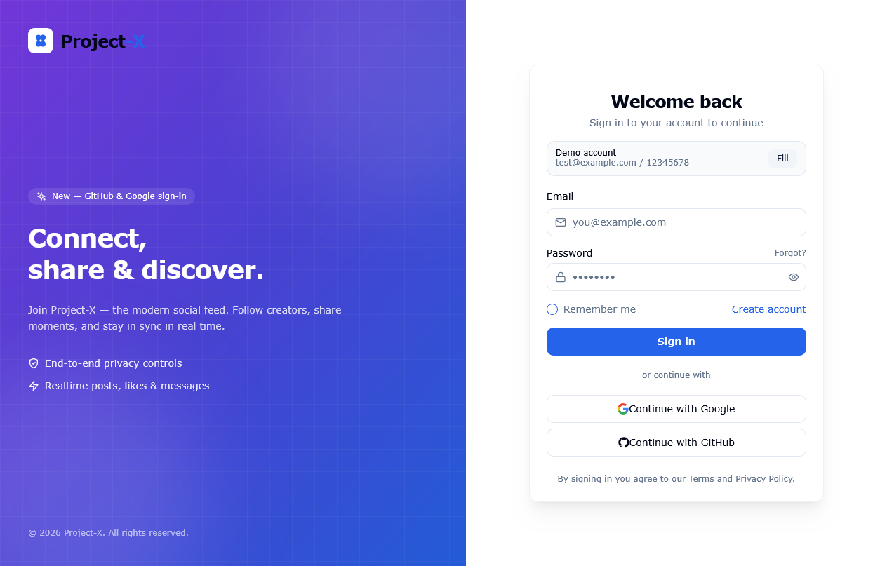
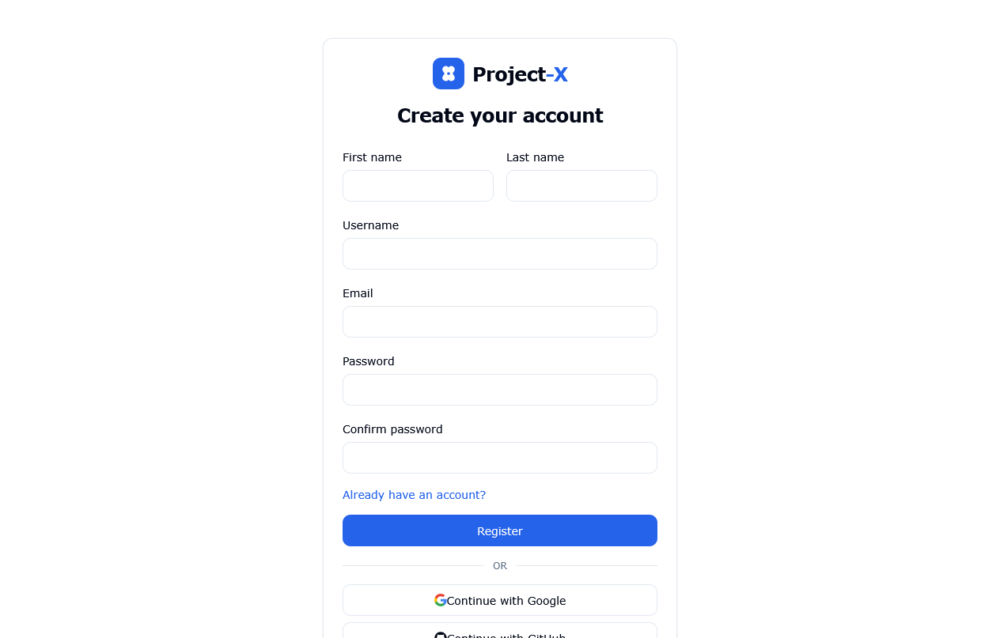
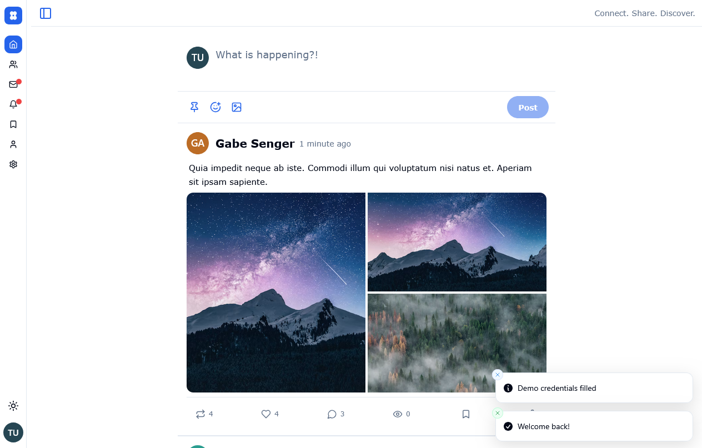
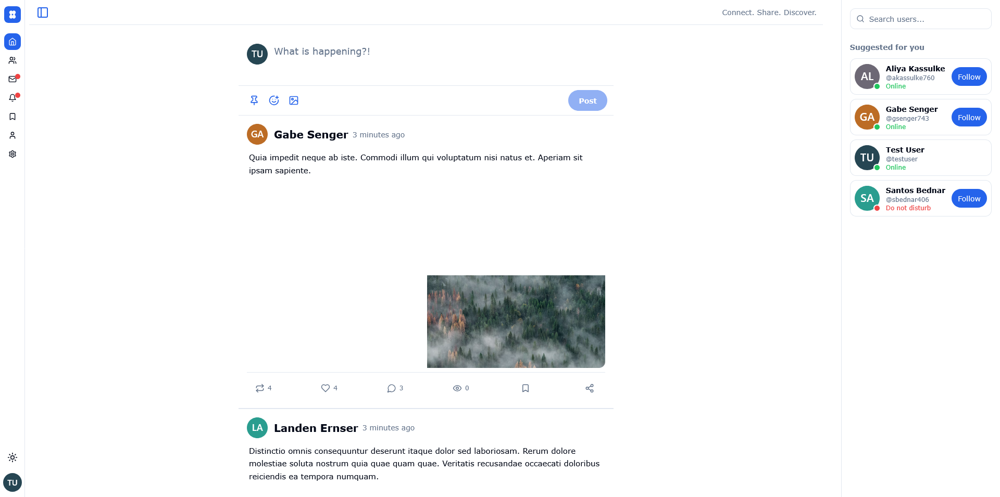
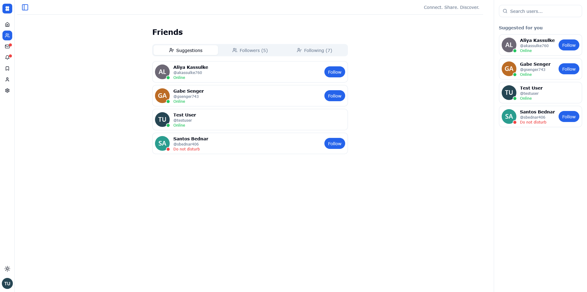
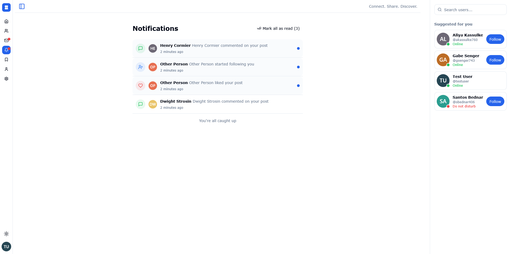
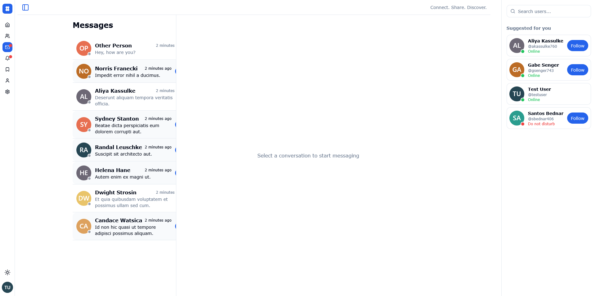
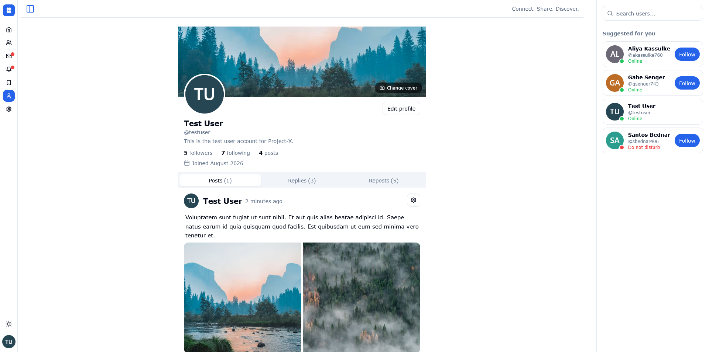
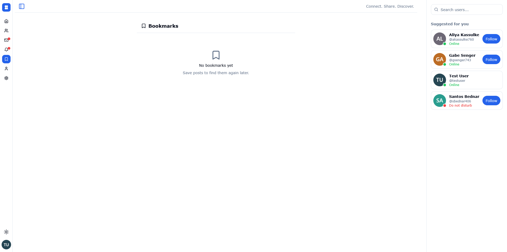
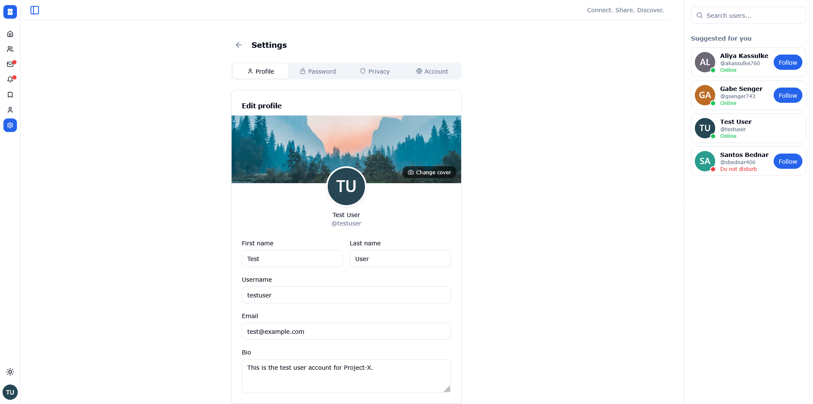

<p align="center">
  
</p>

<h1 align="center">Project-X</h1>

<p align="center">
  <strong>Connect. Share. Discover.</strong><br/>
  A modern, realtime social media platform — Twitter/X-inspired, rebuilt with Laravel + React.
</p>

<p align="center">
  
</p>

<p align="center">
  <a href="#screenshots"></a>
  
  
  
  
  
</p>

---

## Logo

Two overlapping pill-shaped chat bubbles forming an **X** with a central hub — mass, not thin lines, so it never reads as a close button. The hub signals the social graph; the pill mass hints at messages.

| Variant | Preview | Usage |
|---------|---------|-------|
| **App Icon** `32×32` |  | Favicon, `public/logo.svg`, `FRONTEND/src/components/logo.jsx:14` `LogoIcon` |
| **Wordmark** |  | Header, login cards, OG image |
| **Mono** `currentColor` | — | `LogoMark` for dark surfaces |
| **Sidebar** `hsl(var(--sidebar-primary))` | — | Collapsible sidebar (`AppSidebar`) |

```jsx
import { Logo, LogoIcon } from "@/components/logo"
<Logo size={32} wordmarkSize="lg" />          // full lockup
<LogoIcon size={32} variant="sidebar" />      // 32px icon, sidebar theme
<LogoIcon size={16} />                        // favicon scale
```

Static assets: `FRONTEND/public/favicon.svg`, `FRONTEND/public/logo.svg`, `FRONTEND/public/logo-full.svg` (also copied to `BACKEND/public/` on `pnpm build`).

---

## Screenshots

> Captured with the new pill-bubble logo (light + dark) via Playwright against `http://localhost:8000` (seeded MySQL/sqlite). Fresh shots live in `docs/screenshots/` (committed). `e2e-screenshots/` is local-only (gitignored).

| Login | Register |
|-------|----------|
|  |  |

| Home Feed (light) | Home Feed (dark) |
|-------------------|------------------|
|  |  |

| Friends / Follow | Notifications |
|------------------|---------------|
|  |  |

| Messages | Profile |
|----------|---------|
|  |  |

| Bookmarks | Settings |
|-----------|----------|
|  |  |

<p align="center"><em>All screenshots at 1280×800 @2x, seeded user <code>test@example.com</code> / <code>12345678</code></em></p>

---

## Features

- **Auth** — Sanctum SPA + Bearer tokens, OAuth (Google/GitHub), `POST /api/token-login`, `POST /api/logout` revokes current token, heartbeat `POST /api/heartbeat` → `online` status via Reverb.
- **Posts** — UUID PKs, SoftDeletes, create/edit/delete, pins, views deduped+buffered `POST /api/posts/{id}/view`, images (SoftDeletes), carousel.
- **Social** — follows, likes, reposts, bookmarks, nested comments `/posts/{id}/comments`, username+post lookup `/{username}/post/{id}`.
- **Messages** — encrypted room tokens `Crypt::encryptString(partnerId)` at `GET /api/messages/room/{room}`, legacy `/messages/{user}`, unread counts, pin/reply/restore, throttled.
- **Notifications** — `unread-count`, `markAsRead`/`read-all`, hover-card.
- **Realtime** — Laravel Reverb `:8080` + `laravel-echo`/`pusher-js`, `BROADCAST_DRIVER=log` by default, online presence `last_active_at`/`status`.
- **UX** — React 18 + Vite 5, shadcn/ui + Radix + Tailwind 3, React Router `RouterProvider`, Redux Toolkit + TanStack Query, `react-hook-form`+`zod`, dark/light `ThemeProvider`, responsive `AppSidebar` (collapsible `icon`) + `RightBar` + mobile `SidebarMobile`.

---

## Tech Stack

**Backend** `BACKEND/` — Laravel 11, PHP 8.1, Sanctum 4, Reverb 1, Socialite, Pest 2, Pint. Routes: `routes/api.php:1`, `routes/channels.php`, `routes/web.php` (SPA fallback `public/index.html`).

**Frontend** `FRONTEND/` — React 18, Vite 5, pnpm, Tailwind 3, Radix UI, Redux Toolkit, TanStack Query, `laravel-echo`, `pusher-js`, `zod`. Alias `@` → `src` (`vite.config.js`, `vitest.config.js`). Build `pnpm build` → `../BACKEND/public` (`assets/` + `index.html`).

---

## Project Structure

```
Project-X/
├── BACKEND/          # Laravel 11 API (Composer, UUID PKs, SoftDeletes)
│   ├── app/Http/Controllers/Api/
│   ├── routes/api.php
│   └── public/       # built SPA from FRONTEND (index.html + assets/ + logo.svg)
├── FRONTEND/         # React 18 SPA (Vite, pnpm)
│   ├── src/components/logo.jsx   # Logo system (pill X + hub)
│   ├── src/components/ui/        # shadcn/ui
│   ├── src/features/             # post/sidebar
│   ├── src/pages/home/           # Home/Friends/Profile/Messages/Bookmarks
│   └── public/logo.svg, favicon.svg, logo-full.svg
├── docs/screenshots/ # public screenshots for README (committed)
├── e2e_*.py          # Playwright manual checks (not CI, local)
└── e2e-screenshots/  # local run output (gitignored)
```

---

## Prerequisites

- PHP 8.1+, Composer
- Node.js 18+, pnpm (`npm i -g pnpm`)
- MySQL (tests need real MySQL — `phpunit.xml` has sqlite commented out; DB `project_x`)

---

## Backend Setup

```bash
cd BACKEND
composer install
cp .env.example .env
php artisan key:generate
# edit .env: DB_* = project_x, FRONTEND_URL=http://localhost:3000,
# SANCTUM_STATEFUL_DOMAINS=localhost:3000, BROADCAST_DRIVER=log (or reverb)
php artisan migrate:fresh --seed
php artisan serve --host=localhost   # :8000
# optional realtime: php artisan reverb:start  # :8080
```

Verify: `./vendor/bin/pest` (`php artisan test`), `./vendor/bin/pint`, `php artisan route:list`.

**Gotchas:**
- UUID PKs `HasUuids` — routes `whereUuid()`, validation `uuid`, don't cast to `(int)`.
- SoftDeletes on `posts`/`messages`/`images` — `deleted_at` required; `PostResource` uses `relationLoaded`.
- After `migrate:fresh --seed` tokens wiped → stored token `401` must force logout.
- `BACKEND/package.json` stray — ignore, backend is Composer only.

---

## Frontend Setup

```bash
cd FRONTEND
pnpm install
pnpm dev          # :3000 (Vite proxy / VITE_API_URL="")
pnpm build        # → ../BACKEND/public
pnpm test:run     # vitest/jsdom
pnpm lint         # --max-warnings 0
```

Ports: API `:8000`, SPA `:3000` dev / `:5174` e2e. Mismatch breaks CORS/Reverb. `vite.config.js` keeps single `vendor` chunk (splitting caused TDZ on lazy `ProfilePage`).

---

## Usage

1. Register at `/register` or login at `/login` (seed user from `DatabaseSeeder:26`).
2. Home feed: post, like, repost, bookmark, comment.
3. Friends: follow/unfollow, suggestions `GET /api/user/suggestions`.
4. Messages: rooms `GET /api/conversations`, secure `roomForUser`.
5. Notifications & bookmarks.

---

## Contributing

PRs/issues welcome. No CI. Run `pint` + `pnpm lint` + `pest` + `pnpm test:run` before pushing.

## License

MIT — see `LICENSE`.

